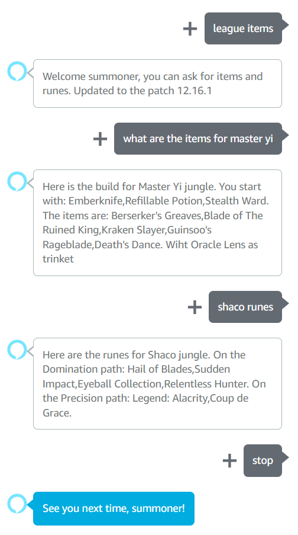

# lol-stats

## About the project


This project handles the data analysis side of the Alexa Skill League of Legends Build (submitted for verification on the Alexa Skill store).

It is designed to be as low-resorces as possible, to run on the Google Cloud Platform Compute Engine free tier.
Therefore MongoDB (specifically the cloud-hosted MongoDB Atlas) was the optimal choice.

You also need an API development Key to access the Riot Api, in order to collect players' and matches' id.\
The aim is to analyze 100'000 games from platinum and diamond across Europe, Korea and America.


###  Installation
1. Get a riot development API Key at [Riot development portal](https://developer.riotgames.com)
2. Clone the repo
	```sh 
	git clone https://github.com/Fedeshadow/lol-stats.git
	```
3. install python packages
	```sh 
	pip install -r ./requiremets.txt
	```
4. Enter your API and mongo credentials in  `config.py`
	```python
	key = "your_lol_API_key_goes_here"
	mongo_username = "your_username_goes_here"
	mongo_pswd = "your_pass_goes_here"
	```
5. run the script (on linux)
	```sh 
	nohup python3 -u main.py &>> activity.log&
	```

### Notes
The current bottleneck is the Development API Key limits as it is not a registered product, yet.
Therefore, in order to optimize API calls, multithreading per region was implemented.

To add regions modify the *Api._init_* function in  `classes.py`:
```python
   self.region = ["euw1","kr","na1"]
```

Same goes for the tiers parameters and languages supported:
```python
   self.tier = ["PLATINUM","DIAMOND"]
   ...
   self.languages = ["it_IT","en_US"]
```
